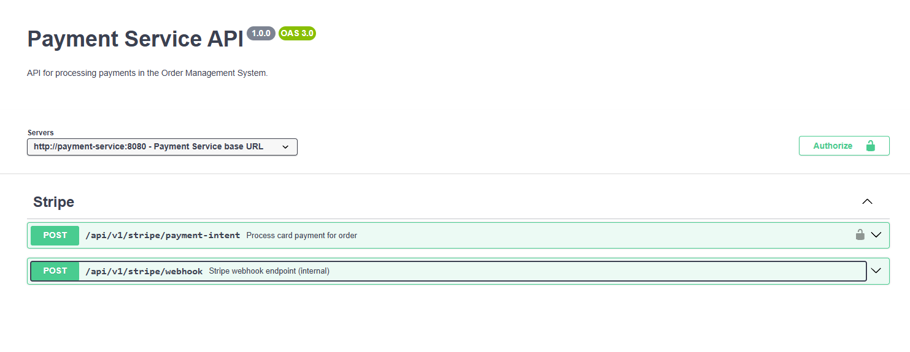

# [Requirements](requirements.md)
---

# OpenAPI and AsyncAPI

## Order Service

### [OpenAPI](OrderService/OpenAPI.yaml)

### [AsyncAPI](OrderService/AsyncAPI.yaml)

## Inventory Service

### [OpenAPI](InventoryService/OpenAPI.yaml)

### [AsyncAPI](InventoryService/AsyncAPI.yaml)

## Payment Service

### [OpenAPI](PaymentService/OpenAPI.yaml)

### [AsyncAPI](PaymentService/AsyncAPI.yaml)

## Notification Service

### [AsyncAPI](NotificationService/AsyncAPI.yaml)

## Auth Service

### [OpenAPI](AuthService/OpenAPI.yaml)
